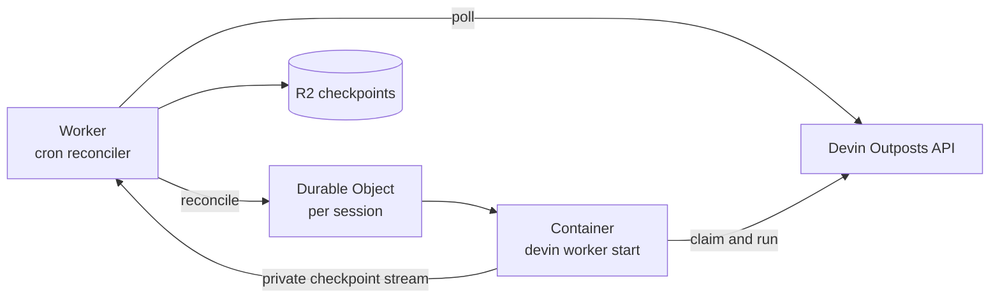

# Devin Outposts on Cloudflare

Run [Devin Outposts](https://docs.devin.ai/cloud/outposts/overview) on Cloudflare, with one isolated [Durable Object Container](https://developers.cloudflare.com/durable-objects/api/container/) per Devin session. Suspended sessions save their workspace to R2 and restore it when they resume.

This template uses Cloudflare Workers, Durable Objects, and Containers directly. It lives in this repository as a deployable container example and does not require the Sandbox SDK package at runtime.

## Deploy

You need a Cloudflare account, a Devin Outpost ID, and a Devin service-user token with the **Run outpost workers** permission.

### Deploy with one click

[](https://deploy.workers.cloudflare.com/?url=https://github.com/cloudflare/sandbox-sdk/tree/main/devin)

The recommended one-click flow prompts for `DEVIN_OUTPOST_ID` and `DEVIN_API_TOKEN`, then provisions the Worker, cron trigger, Durable Object namespace, container application, and R2 checkpoint bucket.

After deployment, verify the Worker using the URL shown by Cloudflare:

```bash
curl https://<your-worker>.workers.dev/
# {"service":"devin-outpost","status":"ok"}
```

### Deploy manually

Manual deployment additionally requires Node.js 24 and a running Docker daemon.

```bash
git clone https://github.com/cloudflare/sandbox-sdk.git
cd sandbox-sdk
npm install
cd devin
npx wrangler login
npx wrangler r2 bucket create devin-outpost-state
```

Set the Outpost ID in `wrangler.jsonc`:

```jsonc
"DEVIN_OUTPOST_ID": "your-outpost-id"
```

The default `DEVIN_API_URL` is `https://api.devin.ai/opbeta`. Change the complete API prefix only when using another Devin environment. The container derives the API origin required by the Devin CLI from this URL.

Add the token and deploy:

```bash
npx wrangler secret put DEVIN_API_TOKEN
npm run deploy
```

If you use another R2 bucket name, update `bucket_name` in `wrangler.jsonc` before deploying.

## Architecture



Once per minute, the Worker polls only the configured Outpost and verifies each response's `metadata.outpost_id` before provisioning anything. It maps Devin's documented statuses to explicit commands for a Durable Object derived from the session ID.

| Devin status         | Action                                           |
| -------------------- | ------------------------------------------------ |
| `pending`, `running` | Ensure the session container is running.         |
| `suspended`          | Allow Devin to exit and save a checkpoint.       |
| `terminated`         | Destroy the container and delete its checkpoint. |
| Unknown or missing   | Log and ignore.                                  |

The Worker owns Devin API polling. Each Durable Object controls one container and does not call Devin. Inside the container, `devin worker start --outpost=... --session=...` owns claiming and the session runtime.

## Suspend and resume

After an un-signaled Devin exit, the container archives:

- `/root`
- `/workspace`
- `/opt/devin-persistent`

The archive is compressed with zstd and uploaded through a private outbound-interception proxy. It is restored before Devin starts again and deleted when the session terminates. Containers receive no R2 credentials, bucket details, or object keys.

This is suspend/resume persistence rather than continuous backup. Abrupt container loss can lose recent work, the compressed archive must fit on temporary disk, and a checkpoint is limited to R2's 5 GiB single-upload limit. An R2 lifecycle expiration is recommended as cleanup protection.

## Configuration

| Setting             | Description                                                                    |
| ------------------- | ------------------------------------------------------------------------------ |
| `DEVIN_OUTPOST_ID`  | Required Devin Outpost ID.                                                     |
| `DEVIN_API_TOKEN`   | Required Devin service-user token with the **Run outpost workers** permission. |
| `DEVIN_API_URL`     | Complete queue API prefix; defaults to `https://api.devin.ai/opbeta`.          |
| `WORKER_ID_PREFIX`  | Acceptor ID prefix; defaults to `cf-outpost`.                                  |
| `DEVIN_CHECKPOINTS` | R2 binding for suspend checkpoints.                                            |

## Operational notes

- Containers run as root and receive the Devin token required by the official CLI. Use separate deployments for mutually untrusted tenants.
- The image includes Git, Chromium, FFmpeg, passwordless `sudo`, TLS certificates, and checkpoint tooling.
- The public Worker exposes only `GET /` for health checks; checkpoint traffic stays on the private interception route.
- R2 archives are temporary until native whole-container snapshots are available. There is no FUSE mount, periodic sync, or background persistence process.

## Local development

```bash
cp .dev.vars.example .dev.vars
# Set DEVIN_API_TOKEN in .dev.vars and DEVIN_OUTPOST_ID in wrangler.jsonc.
npm run dev
```

```bash
npm test
npm run typecheck
```
