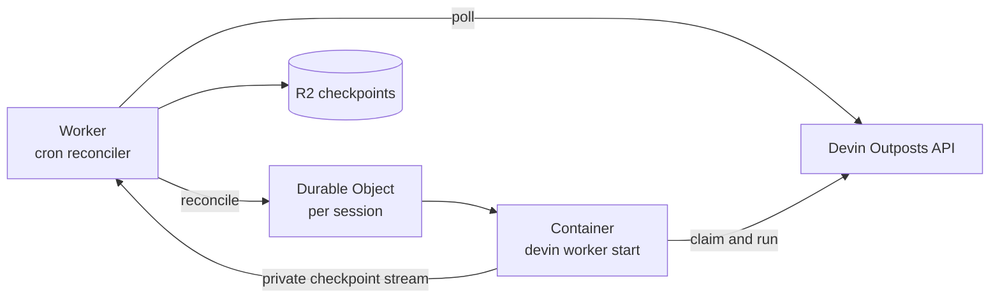

# Devin Outposts on Cloudflare

Run [Devin Outposts](https://docs.devin.ai/cloud/outposts/overview) on Cloudflare, with one isolated [Durable Object Container](https://developers.cloudflare.com/durable-objects/api/container/) per Devin session.

This is a deployable example: connect a Devin Outpost, deploy the Worker, and Cloudflare handles the session containers. Suspended sessions save their workspace to R2 and restore it when they resume.

[](https://deploy.workers.cloudflare.com/?url=https://github.com/cloudflare/sandbox-sdk/tree/main/examples/devin-outpost)

The button provisions the Cloudflare resources and prompts for `DEVIN_API_TOKEN` and `DEVIN_OUTPOST_ID`. The CLI setup below shows the manual flow.

## Quick start

You need:

- a Cloudflare account with Workers, Durable Object Containers, and R2;
- a Devin Outpost;
- a Devin service-user token with the **Run outpost workers** permission;
- Node.js 24 and a running Docker daemon.

### 1. Install

```bash
git clone https://github.com/cloudflare/sandbox-sdk.git
cd sandbox-sdk
npm install
cd examples/devin-outpost
npx wrangler login
```

### 2. Create the R2 bucket

```bash
npx wrangler r2 bucket create devin-outpost-state
```

If you choose another name, update `bucket_name` in `wrangler.jsonc`.

### 3. Add your Devin Outpost

Set the Outpost ID in `wrangler.jsonc`:

```jsonc
"DEVIN_OUTPOST_ID": "your-outpost-id"
```

`DEVIN_API_URL` is the complete queue API prefix and defaults to `https://api.devin.ai/opbeta`. Change it when using another Devin environment. The container derives the API origin required by the Devin CLI from this URL.

Add the API token as a Worker secret:

```bash
npx wrangler secret put DEVIN_API_TOKEN
```

### 4. Deploy

```bash
npm run deploy
```

Wrangler builds the container with your local Docker daemon and deploys the Worker, container application, and cron trigger.

Verify it:

```bash
curl https://<your-worker>.workers.dev/
# {"service":"devin-outpost","status":"ok"}
```

Your Devin Outpost is now ready to run sessions on Cloudflare.

## What gets deployed



Once per minute, the Worker reads the Outpost's session statuses. It ensures `pending` and `running` sessions have a container, allows `suspended` sessions to exit naturally, and destroys `terminated` sessions. Unknown statuses are ignored.

Each container runs the official `devin worker start` CLI. Devin handles the claim and session runtime; this Worker handles the Cloudflare lifecycle around it.

## Suspend and resume

When Devin exits naturally to sleep, the container archives:

- `/root`
- `/workspace`
- `/opt/devin-persistent`

The archive is compressed and streamed through a private Worker proxy into R2. It is restored before Devin starts again and deleted when the session terminates. Session containers receive no R2 credentials or object keys.

This is suspend/resume persistence rather than continuous backup. Abrupt container loss can lose recent work, the compressed archive must fit on temporary disk, and a checkpoint is limited to R2's 5 GiB single-upload limit. An R2 lifecycle expiration is recommended as cleanup protection.

## Configuration

| Setting             | Description                                                                    |
| ------------------- | ------------------------------------------------------------------------------ |
| `DEVIN_OUTPOST_ID`  | Required Devin Outpost ID.                                                     |
| `DEVIN_API_TOKEN`   | Required Devin service-user token with the **Run outpost workers** permission. |
| `DEVIN_API_URL`     | Complete queue API prefix; defaults to `https://api.devin.ai/opbeta`.          |
| `WORKER_ID_PREFIX`  | Acceptor ID prefix; defaults to `cf-outpost`.                                  |
| `DEVIN_CHECKPOINTS` | R2 binding for suspend checkpoints.                                            |

## Things to know

- Containers run as root and receive the Outposts API token required by Devin. Use separate deployments for mutually untrusted tenants.
- The image includes Git, Chromium, FFmpeg, passwordless `sudo`, TLS certificates, and checkpoint tooling.
- The public Worker exposes only `GET /` for health checks; checkpoint traffic uses a private container egress route.
- R2 archives are a temporary persistence layer until native whole-container snapshots are available. There is no FUSE mount, periodic sync, or background persistence process.

## Local development

```bash
cp .dev.vars.example .dev.vars
# Set DEVIN_API_TOKEN in .dev.vars and DEVIN_OUTPOST_ID in wrangler.jsonc.
npm run dev
```

```bash
npm test
npm run typecheck
```
