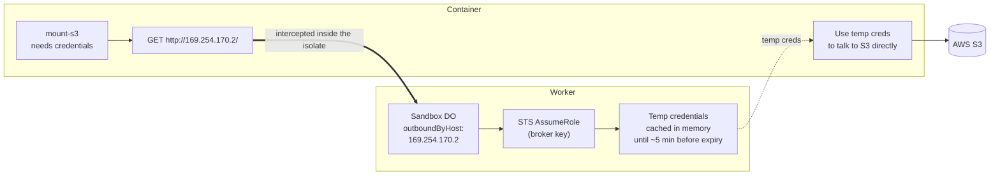

# S3 Mount Example

Mount an AWS S3 bucket as a normal read/write folder inside a Cloudflare Sandbox container. The container never sees a long-lived AWS key — it gets short-lived credentials on demand, issued by the Worker.


> [!IMPORTANT]
> This demo requires FUSE support in the container environment. As such it will not work locally using `wrangler dev` and requires deployment to a production environment via `wrangler deploy`.

## What it demonstrates

- **S3 mounted as a folder** using [`mount-s3`](https://github.com/awslabs/mountpoint-s3), running inside the sandbox container. Files in `/mnt/s3/` are objects in your bucket.
- **Credentials issued by the Worker.** `mount-s3` asks the Worker for credentials whenever it needs them. The Worker calls AWS STS `AssumeRole` and hands back temporary credentials. There is no public credentials endpoint.

  > **What's `AssumeRole`?** It's an AWS API call that asks for temporary credentials (an access key, secret, and session token) for a specific IAM role. The credentials expire after a set time — typically minutes to hours — so even if they leak, the window for misuse is small. The caller needs permission to assume that one role, and nothing else.

- **Small surface for secrets.** The only long-lived secret is an IAM user that can do exactly one thing: assume one specific role. That role can only touch one specific bucket.

## Architecture



1. `mount-s3` is told to fetch credentials from `http://169.254.170.2/` — the well-known ECS task metadata IP. AWS SDKs (including the CRT inside mount-s3) special-case that address as a trusted credentials endpoint and allow plain HTTP for it.
2. The Sandbox DO's `outboundByHost` interceptor catches that request **inside the Worker isolate** before it leaves Cloudflare's network. Nothing ever actually talks to 169.254.170.2; the address is just the agreed-upon hook the SDK already knows how to call.
3. The Worker calls STS `AssumeRole` with its broker IAM key and returns the temporary credentials. They're cached in memory until just before they expire.
4. `mount-s3` uses those credentials to talk to S3 directly. When they're close to expiring, it asks again — the loop repeats.

## Files

```
examples/s3-mount/
├── Dockerfile                 # cloudflare/sandbox base + pinned mount-s3 1.22.3 (SHA-256 verified)
├── wrangler.jsonc             # Worker + container config; vars + secret references
├── .dev.vars.example          # Template for local secrets (broker key + role ARN)
├── src/
│   ├── index.ts            # Worker entrypoint — exports Sandbox, ContainerProxy, default app
│   ├── worker.ts           # Hono app: /api/session, /ws/terminal/:sandboxId, cleanup, exec
│   ├── sandbox.ts          # Sandbox DO + mountBucket() / unmountBucket() helpers
│   └── credentials.ts      # STS AssumeRole + memory cache, exposed as an outbound handler
├── public/
│   └── index.html          # Single-page UI — Start button + xterm.js terminal
├── scripts/
│   ├── setup                  # One-time AWS setup (broker user, role, bucket policy)
│   └── test                   # Bun smoke test — drives /mnt/s3 over the /ws/terminal PTY
└── README.md                  # this file
```

## HTTP API

The Worker's user-facing flow is the browser UI at `/`. The endpoints below back that UI; you can also call them directly if you want to script things.

| Method | Path                              | Purpose                                                                              |
| ------ | --------------------------------- | ------------------------------------------------------------------------------------ |
| `GET`  | `/`                               | Static UI — the Start button + xterm.js terminal                                     |
| `POST` | `/api/session`                    | Spin up a fresh sandbox, mount the bucket, return `{ sandboxId, terminalId, mount }` |
| `WS`   | `/ws/terminal/:sandboxId`         | WebSocket proxy to the session's active terminal, requiring `terminalId` query param |
| `POST` | `/api/session/:sandboxId/cleanup` | Best-effort terminal termination and `fusermount -u /mnt/s3` when the session ends   |
| `POST` | `/api/session/:sandboxId/exec`    | Run an arbitrary shell command in the sandbox (debug only)                           |

> ⚠️ These routes are unauthenticated in this example. Add your own auth layer before exposing publicly.
>
> There is **no public credential endpoint**. Credentials are vended via outbound interception on `169.254.170.2`, which the Sandbox DO's `outboundByHost` catches inside the Worker isolate. The credential payload never leaves Cloudflare's network.

## Setup

Before deploying, you need three things in AWS:

1. **An S3 bucket** — the bucket you want to mount.
2. **An IAM role** (the _container role_) — scoped to that one bucket. This is what the container actually uses to read and write S3.
3. **An IAM user** (the _broker user_) — its only permission is to call `sts:AssumeRole` on the role above. Its access key lives in the Worker as a secret.

The `./scripts/setup` script creates all of these for you. The sections below explain each piece and show the underlying `aws` CLI commands if you'd rather create them by hand (or adapt them to Terraform / CDK / etc.).

### 1. AWS resources

Run the setup script:

```bash
# Optional — point at an existing bucket. If unset, defaults to "my-s3-bucket"
export S3_BUCKET_NAME=my-unique-bucket-name
export AWS_REGION=us-east-1

./scripts/setup
```

It will do the four things listed below. If you'd rather build each piece by hand (or port it to Terraform / CDK / etc.), each bullet has the equivalent `aws` CLI snippet under it. Substitute `ACCOUNT_ID`, `BUCKET_NAME`, and `REGION` with your own values.

- **Check that the bucket exists** (and offer to create it if not).

  ```bash
  # Does the bucket exist & can this account see it?
  aws s3api head-bucket --bucket "${BUCKET_NAME}"

  # us-east-1 is special — it doesn't take a LocationConstraint.
  aws s3api create-bucket \
    --bucket "${BUCKET_NAME}" \
    --region us-east-1

  # Any other region:
  aws s3api create-bucket \
    --bucket "${BUCKET_NAME}" \
    --region "${REGION}" \
    --create-bucket-configuration "LocationConstraint=${REGION}"
  ```

- **Create the broker user** `sandbox-worker-broker` with a single `sts:AssumeRole` permission. This is the only long-lived secret in the system; its access key goes into the Worker.

  ```bash
  aws iam create-user --user-name sandbox-worker-broker

  # It can only assume one role — nothing else.
  aws iam put-user-policy \
    --user-name sandbox-worker-broker \
    --policy-name AssumeRoleOnly \
    --policy-document '{
      "Version": "2012-10-17",
      "Statement": [{
        "Effect": "Allow",
        "Action": "sts:AssumeRole",
        "Resource": "arn:aws:iam::ACCOUNT_ID:role/sandbox-s3-demo"
      }]
    }'

  # Mint an access key — copy these into the Worker secrets.
  aws iam create-access-key --user-name sandbox-worker-broker
  ```

- **Create the container role** `sandbox-s3-demo` with bucket-scoped S3 permissions. The trust policy lets only the broker user assume it; the permission policy grants only the actions `mount-s3` needs, against one bucket.

  ```bash
  # Trust policy: only the broker user can assume this role.
  aws iam create-role \
    --role-name sandbox-s3-demo \
    --max-session-duration 3600 \
    --assume-role-policy-document '{
      "Version": "2012-10-17",
      "Statement": [{
        "Effect": "Allow",
        "Principal": { "AWS": "arn:aws:iam::ACCOUNT_ID:user/sandbox-worker-broker" },
        "Action": "sts:AssumeRole"
      }]
    }'

  # Permission policy: only the actions mount-s3 needs, on one bucket.
  aws iam put-role-policy \
    --role-name sandbox-s3-demo \
    --policy-name sandbox-s3-bucket-access \
    --policy-document '{
      "Version": "2012-10-17",
      "Statement": [{
        "Effect": "Allow",
        "Action": [
          "s3:GetObject",
          "s3:PutObject",
          "s3:DeleteObject",
          "s3:ListBucket",
          "s3:AbortMultipartUpload"
        ],
        "Resource": [
          "arn:aws:s3:::BUCKET_NAME",
          "arn:aws:s3:::BUCKET_NAME/*"
        ]
      }]
    }'
  ```

  The role ARN you'll plug into the Worker secret is `arn:aws:iam::ACCOUNT_ID:role/sandbox-s3-demo`.

- **Print the values you need to paste into `.dev.vars`** — the broker access key + secret and the role ARN.

### 2. Configure secrets

Paste the printed block into `.dev.vars` (for local dev) and set the same values as Worker secrets for production:

```bash
wrangler secret put BROKER_AWS_ACCESS_KEY_ID
wrangler secret put BROKER_AWS_SECRET_ACCESS_KEY
wrangler secret put AWS_ROLE_ARN
```

Update the `vars` block in `wrangler.jsonc` to match your bucket and region.

### 3. Deploy

```bash
wrangler deploy
```

## Usage

Open the deployed Worker in a browser:

```
https://sandbox-s3-mount-example.<your-account>.workers.dev/
```

Click **Start**. The page does the rest:

1. `POST /api/session` provisions a fresh sandbox container, mounts the bucket at `/mnt/s3`, and allocates a single interactive `bash` terminal.
2. xterm.js opens a WebSocket to `/ws/terminal/:sandboxId?terminalId=:terminalId` and connects you to that terminal. `mountBucket()` drops a one-liner into `~/.bashrc`, so the shell lands you in `/mnt/s3` — every read/write you do is hitting the bucket directly.
3. When you `exit` the shell (or close the tab), the page calls `POST /api/session/:sandboxId/cleanup` with the `terminalId` in the body to terminate the terminal and unmount the bucket. The next click on Start spins up a brand-new sandbox.

If you'd rather drive the bucket from your own code, point a PTY client at `/ws/terminal/...` (see `scripts/test` for a small Bun example) or call `/api/session/:sandboxId/exec` for one-off commands.

## Credential rotation

`mount-s3` refreshes its credentials automatically about 5 minutes before they expire. The Worker's in-memory cache uses the same 5-minute buffer — it refuses to hand out a credential that's within 5 minutes of expiring. That way the container and the Worker always agree on whether a credential is still good.

You can shorten the session length (down to 900 seconds) by setting `STS_DURATION_SECONDS` in `wrangler.jsonc`.

For the protocol mount-s3's AWS CRT speaks when it fetches credentials, see the AWS SDK reference for [`AWS_CONTAINER_CREDENTIALS_FULL_URI`](https://docs.aws.amazon.com/sdkref/latest/guide/feature-container-credentials.html).

## Revocation playbook

There are three ways to cut off access, from fast and reversible to permanent:

**Hard kill (incidents):** apply a `Deny *` policy with `aws:TokenIssueTime` < now. This invalidates every active session in seconds, without restarting the Worker or container.

```bash
aws iam put-role-policy --role-name sandbox-s3-demo --policy-name RevokeNow \
  --policy-document "{\"Version\":\"2012-10-17\",\"Statement\":[{
    \"Effect\":\"Deny\",\"Action\":\"*\",\"Resource\":\"*\",
    \"Condition\":{\"DateLessThan\":{\"aws:TokenIssueTime\":\"$(date -u +%Y-%m-%dT%H:%M:%SZ)\"}}
  }]}"
```

**Soft kill:** rotate the broker access key — `aws iam create-access-key` + `aws iam delete-access-key`, then update the Worker secret. Existing sessions keep working until they expire normally.

**Permanent shutdown:** detach the bucket policy or delete the role.

## Security notes

- The broker IAM user can only call `sts:AssumeRole` on **one** role. It cannot touch S3 directly.
- The role's policy is scoped to one bucket — `AmazonS3FullAccess` is never used.
- Temporary credentials never leave the Worker isolate. mount-s3 fetches them from `169.254.170.2`, which `outboundByHost` short-circuits before the request hits the network.
- Temporary credentials live only in DO memory — they're never written to storage.
