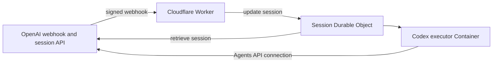

# OpenAI Agents API executor on Cloudflare

[OpenAI Agents API][#agents-api] gives your application access to the Codex harness through an OpenAI-managed API. OpenAI manages sessions, orchestration, context compaction, and recovery while your application provides tools and Cloudflare Containers can be used as the execution environment.

[#agents-api]:

Run self-hosted OpenAI Agents API sessions in Cloudflare Containers. Each Durable Object is backed by a container running `codex exec-server`. Session orchestration is managed via signed OpenAI webhooks.

> [!IMPORTANT]
> This template uses Cloudflare Workers, Durable Objects, and Containers directly. It does not require the Sandbox SDK package at runtime. The codex binary running in the container provides all the functionality required.

## Deploy

You need a Cloudflare account with Containers access and access to the OpenAI Agents API.

[](https://deploy.workers.cloudflare.com/?url=https://github.com/cloudflare/sandbox-sdk/tree/main/openai/agents-api)

Configure these settings:

| Setting                       | Description                                                                                                                                  |
| ----------------------------- | -------------------------------------------------------------------------------------------------------------------------------------------- |
| `EXECUTOR_CLIENT_SECRET`      | Bearer token that protects manual executor cleanup requests. Generate one with `openssl rand -hex 32`.                                       |
| `OPENAI_EXECUTOR_API_KEY`     | Restricted key passed to Codex. Requires `api.model.read` and `api.agents.environments.connect`.                                             |
| `OPENAI_API_KEY`              | Controller key used to retrieve session state. Requires `api.agents.read` and must belong to the same project and owner as the executor key. |
| `OPENAI_AGENT_ID`             | OpenAI agent served by this deployment. Sessions for other agents are ignored.                                                               |
| `OPENAI_WEBHOOK_SECRET`       | Signing secret returned when the Worker webhook is registered with OpenAI.                                                                   |
| `EXECUTOR_KEEP_ALIVE_SECONDS` | Seconds before the lifecycle deadline checks current session state. The default is `30`.                                                     |
| `EXECUTOR_PREWARM_ENABLED`    | Starts self-hosted Containers when `agent.session.created` arrives. The default is `true`.                                                   |
| `EXECUTOR_SNAPSHOTS_ENABLED`  | Snapshots the whole Container after confirmed idle and restores it on the next start. The default is `true`.                                 |

For one-click deployment:

1. Deploy with `OPENAI_WEBHOOK_SECRET` set to `pending-webhook-registration`.
2. Register `https://<your-worker>.workers.dev/webhook` in OpenAI for:
   - `agent.session.created`
   - `agent.session.action_required`
   - `agent.session.in_progress`
   - `agent.session.idle`
   - `agent.session.failed`
3. Under Settings replace the existing `OPENAI_WEBHOOK_SECRET` value with the signing secret returned by OpenAI.
4. Save & deploy the new Worker version.

The webhook returns `503 Service Unavailable` until all required settings are present and the webhook secret is no longer pending.

For local development:

```bash
git clone https://github.com/cloudflare/sandbox-sdk.git
cd sandbox-sdk
npm install
cd openai/agents-api
cp .dev.vars.example .dev.vars
npm run dev
```

The Worker verifies every webhook signature. A self-hosted `agent.session.created` event prewarms its Container when prewarming is enabled. `agent.session.action_required` retrieves current session state and gets the environment ID and remote URL from that response. `agent.session.in_progress` re-arms the lifecycle deadline. `agent.session.idle` snapshots the Container when enabled and arms the deadline that stops idle compute. `agent.session.failed` reconciles terminal cleanup.

When the deadline expires, the Worker retrieves current session state. Active sessions get another deadline. Idle sessions are destroyed while preserving the snapshot created by the idle event. Failed and deleted sessions stop without preserving snapshots. Other agents, environment types, and unknown webhook events are ignored.

## Health Check

```bash
curl --fail-with-body "https://<your-worker>.workers.dev/health"
```

A configured deployment returns:

```json
{
  "service": "openai-agents-api-executor",
  "configured": true,
  "webhook_configured": true
}
```

`configured` checks the executor key, cleanup secret, and keep-alive deadline. `webhook_configured` checks the controller key, agent ID, and webhook secret.

## Deploy manually

Manual deployment requires Node.js 24, npm, Wrangler, and a running Docker daemon. From `openai/agents-api` in an installed checkout, log in to Wrangler:

```bash
npx wrangler login
```

Generate a new `EXECUTOR_CLIENT_SECRET`:

```bash
openssl rand -hex 32
```

Install the required secrets and deploy:

```bash
npx wrangler secret put OPENAI_EXECUTOR_API_KEY
npx wrangler secret put EXECUTOR_CLIENT_SECRET
npx wrangler secret put OPENAI_API_KEY
npx wrangler secret put OPENAI_AGENT_ID
npx wrangler secret put OPENAI_WEBHOOK_SECRET
npm run deploy
```

`EXECUTOR_KEEP_ALIVE_SECONDS`, `EXECUTOR_PREWARM_ENABLED`, and `EXECUTOR_SNAPSHOTS_ENABLED` are non-secret settings in `wrangler.jsonc`.

## Architecture



Only `OPENAI_EXECUTOR_API_KEY` enters the Container. The controller key and webhook secret remain in the Worker.

## Workspace and lifecycle behavior

When snapshots are enabled, confirmed idle state creates a whole-Container snapshot. The next environment connection restores that snapshot, including `/workspace`. Snapshot failures leave the current Container running and schedule another deadline.

Container starts, environment-connection actions, in-progress events, and confirmed idle state arm `EXECUTOR_KEEP_ALIVE_SECONDS`. When the idle deadline expires, the alarm destroys the Container without deleting its saved snapshot. The Worker monitors each Container and distinguishes expected cleanup from unexpected crashes.

## Cleanup

The Worker releases the Container and clears saved snapshots when OpenAI reports that a session failed or when a session lookup returns `404 Not Found`. An idle session keeps its snapshot for the next environment connection.

You can also destroy an executor manually without enabling programmatic starts:

```bash
export WORKER_URL="https://openai-agents-api-executor.<your-subdomain>.workers.dev"
export EXECUTOR_CLIENT_SECRET="your-generated-secret"
export SESSION_ID="sess_..."

curl --fail-with-body \
  -X DELETE "$WORKER_URL/executors/$SESSION_ID" \
  -H "Authorization: Bearer $EXECUTOR_CLIENT_SECRET"
```

## Further Reading

- [Getting Started Guide](https://developers.cloudflare.com/sandbox/guides/openai-agents-api)
- [OpenAI Agents API Documentation](https://developers.openai.com/agents-api/)
